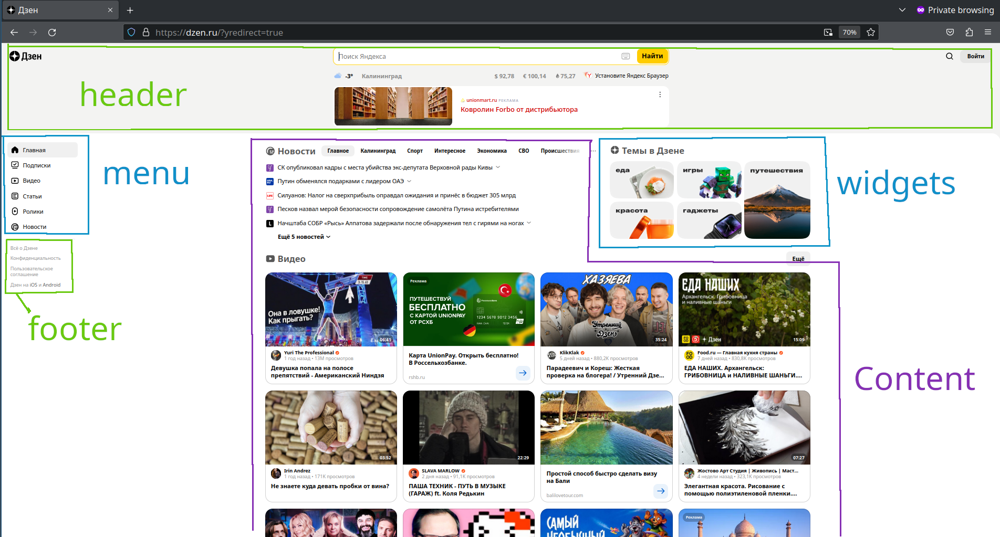
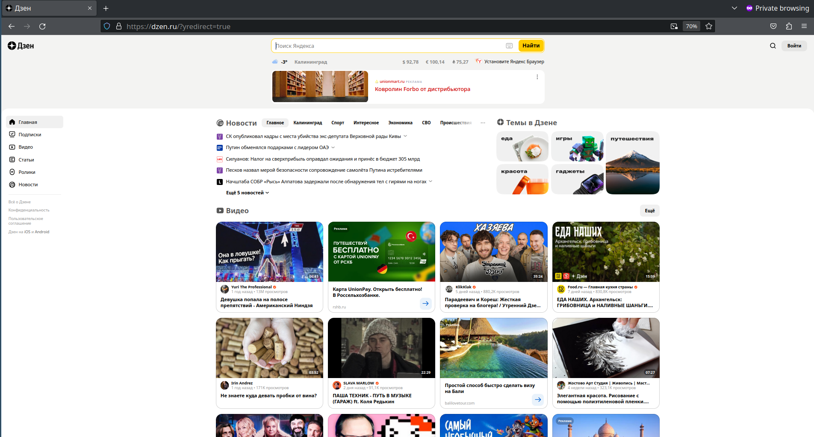
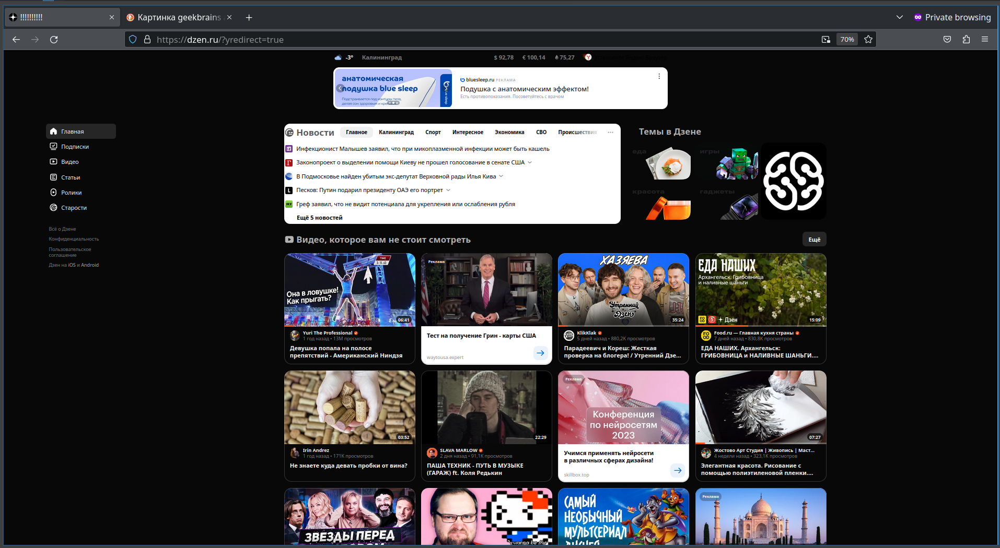

### Задача:

на основе сайта _yandex.ru_:
- Определите, на каком протоколе работает сайт.
- Проанализируйте структуру страницы сайта.
- Внесите не менее 10 изменений на страницу с помощью инструмента разработчика и представьте скриншоты было/стало.

### Решение

1. На основе протокола HTTPS.

2. Сейчас yandex.ru плавно редиректит на dzen.ru. Условная структура:

3. Изменения:
- убрал поисковую строку Яндекса
- убрал заголовок dzena
- в body изменил значение class="Theme Theme_color_light Theme_root_light pointerfocus" на class="Theme Theme_color_dark Theme_root_dark pointerfocus" (нашел в значениях стилей)
- поменял название пункта меню "Новости" на "Старости"
- поменял название поля "Видео" на "Видео, которое вам не стоит смотреть"
- поменял цвет заголовков контента на hsla(87.5, 56%, 62.5%, 0.69)
- поменял размер шрифта заголовков контента с 24px на 48px
- заголовок вкладки(title) сменил на "!!!!!!!!"
- сменил 1 из картинок в "Темы в dzen" на логотип GeekBrains
- сместил блок меню влево на 100px

Было:

Стало:
